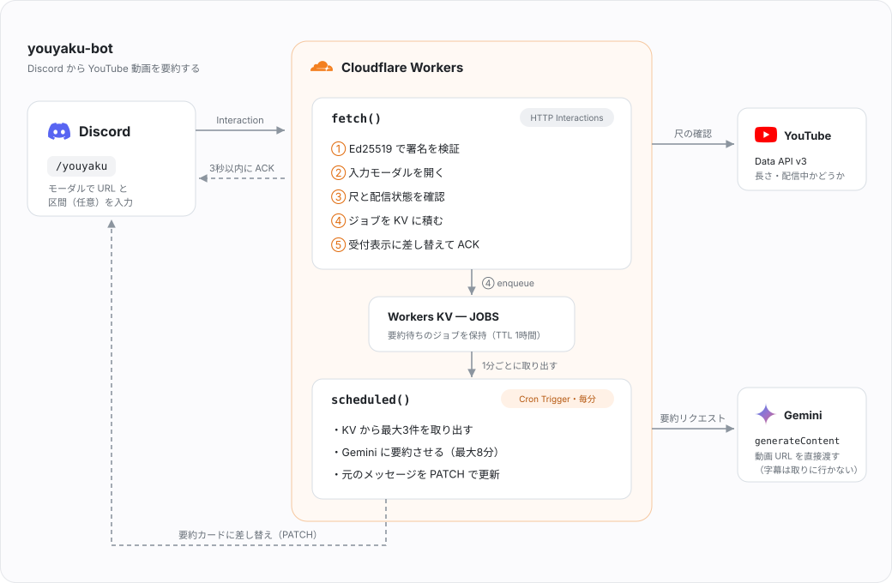

# youyaku-bot

[](https://developers.cloudflare.com/workers/)
[](https://ai.google.dev/)
[](https://discord.com/developers/docs/interactions/overview)
[](https://www.typescriptlang.org/)

Discord から YouTube 動画を要約する Bot。Cloudflare Workers 上で動き、**無料枠のみで運用できる**。

カードゲーム（シャドウバース）の解説・対戦動画を対象に、マリガン基準や打点計算といった
**上達につながる情報だけを抜き出す**ようプロンプトを組んである。雑談や告知は落とす。

- `/youyaku` にURLを貼るだけ。動画の区間（例: `1:20:00`〜`1:50:00`）も指定できる
- 字幕のない動画も要約できる（動画そのものを Gemini に渡すため）
- 各項目にタイムスタンプが付き、**クリックでその場面から再生できる**
- 無駄なトークンを使わないよう、長すぎる動画と配信中の動画は要約前に弾く
- サーバー不要。Workers + KV + Cron Trigger だけで完結する

## 目次

- [使い方](#使い方)
- [構成](#構成)
- [セットアップ](#セットアップ)
- [コストと制限](#コストと制限)
- [実測データ](#実測データ)
- [開発](#開発)
- [トラブルシューティング](#トラブルシューティング)
- [ファイル構成](#ファイル構成)

## 使い方

`/youyaku` を実行すると入力フォームが開く。

| 項目 | 必須 | 内容 |
| --- | --- | --- |
| 動画のURL | ✅ | `https://www.youtube.com/watch?v=...` |
| 開始時刻 | | 省略で先頭から |
| 終了時刻 | | 省略で最後まで。区間は最大1時間 |

時刻は次の3通りで書ける。開始と終了で書式を揃える必要はない。

| 書式 | 例 | 意味 |
| --- | --- | --- |
| コロン区切り | `1:23:45` `12:34` | `H:MM:SS` または `MM:SS` |
| 単位付き | `1h` `1h30m` `90m` `5400s` | h / m / s を組み合わせる |
| 数値のみ | `5400` | 秒 |

2時間の動画の後半1時間なら、開始 `1:00:00`・終了 `2:00:00`、あるいは単に **開始 `1h`・終了 `2h`** と書けばよい。

> [!NOTE]
> コロン区切りで要素が2つのときは `MM:SS` 解釈になる。`1:00` は1分であって1時間ではない。
> 時単位で指定したいときは `1:00:00` か `1h` と書く。

要約の対象が1時間を超える場合と、配信中・プレミア公開の予約状態の動画は、
**Gemini を呼ぶ前に弾く**（本人にのみ表示）。1時間を超える動画は区間を指定すれば要約できる。
「ちょうど1時間」の動画が実測で数十秒はみ出すことがあるため、拒否は1時間1分から。

`/quota` で無料枠の残りとリセット時刻を確認できる（本人にのみ表示）。

要約は動画のサムネイル付きカードと一緒に投稿され、各項目の先頭に付くタイムスタンプは
**クリックでその場面から再生できる**リンクになる。

## 構成



`/youyaku` を打ってから要約が届くまでの流れは次のとおり。

1. Discord が Interaction を Worker に POST する
2. `fetch()` が Ed25519 署名を検証し、入力モーダルを返す
3. モーダルの送信を受けて、YouTube Data API で尺と配信状態を確認する（NG ならここで終了）
4. ジョブを Workers KV に積み、「🔄 受け付けました」に差し替えて **3秒以内に ACK** を返す
5. 毎分の Cron Trigger で `scheduled()` が起き、KV からジョブを取り出す
6. Gemini に要約させ、元のメッセージを PATCH で要約カードに差し替える

### 要約を Cron に逃がしている理由

`fetch()` ハンドラは ACK を返した後、無料プランだと **30 秒**しか生き延びられない
（`ctx.waitUntil()` の上限）。しかし実測では 31分の動画の初回要約に **約 139 秒**かかった。
Cron Trigger は実行上限が 15 分あり、この制約を受けない。

代償として、Cron の最小間隔が 1 分なので**最大 60 秒の待ちが上乗せ**される。

### 字幕スクレイピングをしない理由

`timedtext` 系の非公式エンドポイントは、データセンター IP（Cloudflare / AWS / GCP）からの
アクセスを YouTube がブロックする。ローカルで動いてもデプロイ後に必ず壊れる。
代わりに Gemini へ YouTube URL をそのまま渡し、動画の取得・解析を Google 側に任せている。
字幕が付いていない動画も要約できる。

### Interactions API ではなく generateContent を使う理由

区間指定（`videoMetadata` の `startOffset` / `endOffset`）が Interactions API に未実装のため。

### 尺の確認に Data API を使う理由

oEmbed は動画の長さを返さない。`googleapis.com` 宛ての Data API はデータセンター IP でも
弾かれないため、こちらから `contentDetails.duration` と `liveBroadcastContent` を取る。
**取得に失敗した場合は尺を確認せずそのまま要約する**（外部要因でユーザーの操作を止めない方針）。

## セットアップ

必要なもの: Node.js 22 以上（`npm run measure` が `--experimental-strip-types` を使う）、
Cloudflare アカウント、Discord アカウント、Google アカウント。

### 1. Discord アプリ

[Developer Portal](https://discord.com/developers/applications) で New Application。

- **一般情報** → `PUBLIC KEY` と `APPLICATION ID` を控える
- **Bot** → `Reset Token` でトークンを発行して控える（コマンド登録にのみ使用）
- **Installation** → Guild Install のスコープに `applications.commands` を追加し、
  生成された URL からサーバーに導入する

Message Content Intent は不要（メッセージを読まないため）。Bot の権限設定も不要
（応答は interaction token 経由で返すため、チャンネルへの書き込み権限を使わない）。

### 2. Gemini API キー

[Google AI Studio](https://aistudio.google.com/apikey) で発行する。

要約前の尺チェックに YouTube Data API v3 を使う。キーが紐づく Google Cloud プロジェクトで
この API を有効化すれば、同じキーがそのまま使える。別のキーを使う場合は `YOUTUBE_API_KEY` に入れる。
流用できるかは次で確認できる。

```bash
curl "https://www.googleapis.com/youtube/v3/videos?part=contentDetails&id=dQw4w9WgXcQ&key=$GEMINI_API_KEY"
```

`items` が返れば流用可。`401 API keys are not supported by this API` は
**そのプロジェクトで API が有効化されていない**という意味なので、Cloud Console で有効化する。

**チェックに失敗した場合は尺を確認せずそのまま要約する**ので、設定しなくても Bot は動く。
ただし1時間超の動画や配信中の動画を弾けなくなる。

### 3. ローカル設定

```bash
npm install
cp .dev.vars.example .dev.vars   # 値を埋める
```

### 4. KV namespace を作る

```bash
npx wrangler kv namespace create JOBS
```

出力された id を `wrangler.jsonc` の `kv_namespaces` に書く。

### 5. コマンド登録とデプロイ

```bash
npm run register                          # コマンド定義を変えたときだけ
npx wrangler secret put DISCORD_PUBLIC_KEY
npx wrangler secret put GEMINI_API_KEY
npm run deploy
```

`.dev.vars` の `DISCORD_GUILD_ID` を指定すると対象サーバーに即時反映される。
空ならグローバル登録になり、反映まで最大 1 時間かかる。

### 6. エンドポイントを Discord に登録

デプロイ時に表示される `https://<name>.<subdomain>.workers.dev` を、
**一般情報 → インタラクション・エンドポイントURL** に設定して保存。

> ⚠️ 「ウェブフック」ページの「エンドポイントURL」とは**別物**。そちらはアプリイベント用。

保存時に Discord が署名付き PING を送るため、**署名検証が動いていないとここで保存に失敗する**。

### 環境変数

| 名前 | 必須 | 使う場所 | 内容 |
| --- | --- | --- | --- |
| `DISCORD_PUBLIC_KEY` | ✅ | Worker | 署名検証に使う公開鍵 |
| `GEMINI_API_KEY` | ✅ | Worker | 要約と（既定では）尺チェック |
| `YOUTUBE_API_KEY` | | Worker | 尺チェック用。未指定なら `GEMINI_API_KEY` を流用 |
| `GEMINI_MODEL` | | Worker | 候補モデルをカンマ区切りで。前から順に試す。既定は `gemini-3.6-flash,gemini-3.5-flash`（`wrangler.jsonc` の `vars`） |
| `DISCORD_APPLICATION_ID` | ✅ | register のみ | スラッシュコマンドの登録先 |
| `DISCORD_BOT_TOKEN` | ✅ | register のみ | 登録 API の認証 |
| `DISCORD_GUILD_ID` | | register のみ | 指定したサーバーへ即時反映。空でグローバル登録 |

Worker 側の必須 2 つは `wrangler secret put` で登録する。register 用の値は `.dev.vars` にだけあればよい。

## コストと制限

| 項目 | 無料枠 | 備考 |
| --- | --- | --- |
| Workers リクエスト | 10万/日 | 個人利用なら十分 |
| Workers CPU 時間 | 10ms/呼び出し | `fetch()` の待ち時間は加算されない |
| Cron Trigger 実行時間 | 15分 | 要約の実質的な上限 |
| KV 書き込み | 1,000/日 | 1 リクエストにつき数回 |
| Gemini 動画 | 8時間/日 | 公開動画のみ |
| Gemini 1リクエスト | 3時間 | 低解像度時。コンテキスト1Mによる制約 |
| YouTube Data API | 10,000ユニット/日 | 尺の確認は1回1ユニット。実質無制限 |

Gemini 自体は3時間まで扱えるが、待ち時間と枠の消費を抑えるため Bot 側では**1時間で打ち切っている**
（`MAX_CLIP_SECONDS`）。ちょうど1時間の動画が数十秒はみ出すことがあるため、実際に弾くのは1時間1分から。

Gemini の無料枠は**入力データが学習に利用され得る**。非公開の動画を扱う用途では有償プランを検討すること。

`/quota` が出す残量は **Bot 側の自前集計**。Google が残量 API を公開していないため、
要約が成功するたびに「何秒ぶんの動画を投げたか」を KV に足している。実カウントとは差が出る。

### 429 の2種類

| 種類 | 回復まで | 挙動 |
| --- | --- | --- |
| 1日の上限 | 太平洋時間0時（日本時間16時） | 再試行しない |
| 分あたりのトークン上限 | 数十秒 | **自動で最大4回再試行** |

長い動画は 1 回で 20 万トークンを超えるため後者に当たりやすい。区間を短く切ると通りやすい。

### 503（混雑）とモデルの切り替え

Gemini は混雑時に `503 This model is currently experiencing high demand` を返す。
これは**モデル単位**で起きるため、1つが混んでいても隣のモデルは空いていることが多い。

そこで `GEMINI_MODEL` の候補を**前から順に試し、全部が混んでいた場合だけ**
30 / 60 / 90 秒と間隔を空けて最初から試し直す。モデル間の移動に待機は挟まない
（待つより隣に移るほうが速いため）。動画側の問題（非公開・地域制限など）は
どのモデルでも同じ結果になるので、その場合は切り替えずに即座に諦める。

混雑時は**重いリクエストから順に落とされる**。実測（2026-08-14 の混雑時）では、
同じ動画でも 5 分の区間は通り、30 分の区間は 503 だった。長い配信を要約するときは
20 分以内に区切ると通りやすい。

## 実測データ

2026-08-09 時点、`gemini-3.6-flash`。

| 動画 | 所要 | 入力トークン |
| --- | --- | --- |
| 19秒 | 6.8〜15.7s | 約1,700 |
| 3分33秒 | 9.2〜21.9s | 約19,500 |
| 90分（初回・区間なし） | **138.8s** | 172,327 |
| 90分（2回目以降・区間なし） | 30〜43s | 172,813 |
| 90分のうち10分を指定 | 29〜31s | 55,258 |

読み取れること:

- **所要時間を支配するのは出力の長さで、動画の尺ではない**
- **同じ動画の初回リクエストだけ極端に遅い**。動画の取り込みが初回に走るとみられる
- **区間を指定すると解像度が上がる**。区間なしは約32トークン/秒まで間引かれるが、
  区間ありは約92トークン/秒。精度は上がるが消費も増える

## 開発

```bash
npm run dev        # ローカル起動
npm run typecheck  # 型チェック
npm run measure -- <URL> [--from 0:00 --to 30:00] [--print]
npx wrangler tail  # 本番ログ
```

`measure` は Worker と同じ `src/gemini.ts` を読み込むため、結果が本番の挙動と一致する。
Discord を経由しないので `GEMINI_API_KEY` だけで動く。プロンプトを触ったときはこれで確認する。

Cron は待たずに手動発火できる。

```bash
npx wrangler dev --test-scheduled
curl "http://localhost:8787/__scheduled"
```

## トラブルシューティング

| 症状 | 原因と対処 |
| --- | --- |
| エンドポイントURL の保存に失敗する | 署名検証が通っていない。`DISCORD_PUBLIC_KEY` が **PUBLIC KEY**（Bot Token ではない）か、デプロイ済みかを確認する |
| `/youyaku` が候補に出ない | `npm run register` が未実行。グローバル登録は反映に最大1時間かかるので、`DISCORD_GUILD_ID` を指定して登録し直す |
| 「🔄 受け付けました」から変わらない | Cron が動いていない。`wrangler.jsonc` の `triggers.crons` と `npx wrangler tail` を確認する。15分を過ぎると interaction token が失効し、ジョブは破棄される |
| 1時間超の動画が弾かれない | YouTube Data API v3 が有効化されていない。ログに `youtube data api failed status=` が出る |
| 「この動画にアクセスできませんでした」 | 年齢制限・埋め込み無効・地域制限・限定公開のいずれか。Gemini 側から動画を取得できていない |
| レート制限で失敗する | [429 の2種類](#429-の2種類)を参照。区間を短く切ると通りやすい |
| 「Gemini が混雑しており」が出る | Google 側の一時的な過負荷。[503（混雑）とモデルの切り替え](#503混雑とモデルの切り替え)を参照。区間を短くするか、`GEMINI_MODEL` に空いているモデルを足す |

## ファイル構成

| パス | 役割 |
| --- | --- |
| `src/index.ts` | `fetch()`（署名検証 → モーダル → ジョブ投入）と `scheduled()`（要約実行） |
| `src/gemini.ts` | Gemini 呼び出し、プロンプト、再試行、エラー文言の変換 |
| `src/jobs.ts` | KV を使ったジョブの積み下ろしと、失効ジョブの破棄 |
| `src/quota.ts` | 無料枠の消費を日次で記録（Google は残量 API を出していないため自前集計） |
| `src/timecode.ts` | `1:23:45` `90m` などの時刻解釈と区間の検証、長さの上限 |
| `src/youtube.ts` | URL の正規化、タイムスタンプのリンク化、サムネイルと尺の取得 |
| `src/discord.ts` | Ed25519 検証、モーダル値の読み取り、follow-up 送信、embed 分割 |
| `scripts/register.mjs` | スラッシュコマンド登録 |
| `scripts/measure.mjs` | 要約レイテンシの実測 |
| `docs/architecture.svg` | 構成図 |
